# esp32-claude — a Claude Code usage monitor on a round ESP32 display

A desk companion that shows how much of your **Claude Code** session and weekly
limits you have left, on a 240×240 round GC9A01 display driven by an ESP32 over
Bluetooth LE. A small Python script on your laptop reads your usage and pushes
it to the device; a pixel crab reacts to how hard Claude is working and how much
quota is left.

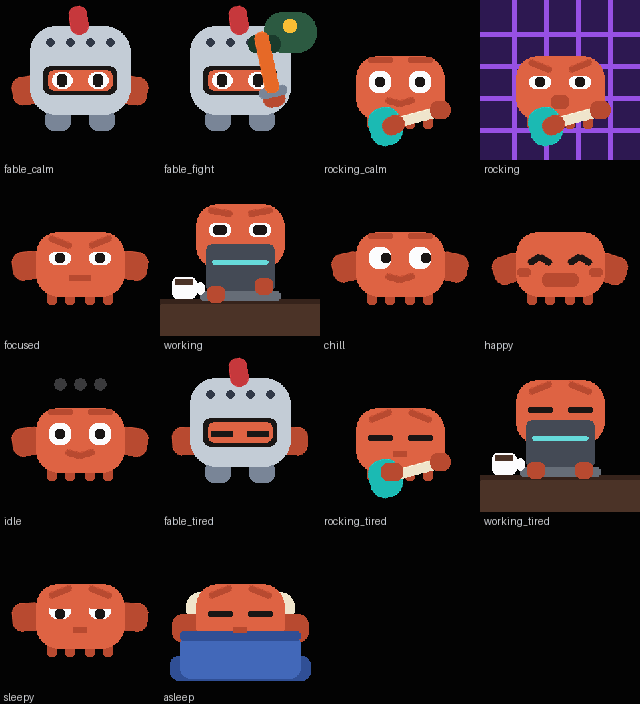

Unofficial project. Not affiliated with, endorsed by, or supported by Anthropic.

---

## Why

`/usage` tells you where you stand, but only when you stop and ask. This puts
the same numbers on your desk, glanceable, so you notice you are at 85% of your
5-hour window *before* you start a big refactor rather than halfway through it.

The percentages are the **real** ones — the same figures Claude Code's own
Account & Usage panel shows, not an estimate derived from token counts.

## Features

- **Real session and weekly quota percentages**, read from Claude Code's own
  cache rather than guessed from token totals
- **Correct reset times** in local time, taken from the actual quota boundary
- **Three data views**, cycled with two buttons: session, weekly, today
- **Arc gauge** around the rim, green → orange → red at 70% / 90%
- **Live model and reasoning effort** (`opus-5 / xhigh`), which `ccusage` does
  not expose — read from Claude Code's transcripts
- **A crab that reacts** to model, effort, remaining quota and whether
  Claude is actually doing anything
- **Reconnects on its own** when the laptop sleeps or the device reboots
- **Never blanks or shows zeros** when disconnected — it keeps the last reading
  and tells you how old it is

## The crab

The mascot's expression is driven by what Claude is doing and how much session
quota is left. Quota wins over everything else: a crab that looks alert while
the session is spent would be actively misleading.

Every model has its own pair, split at `high` effort:

| Model | below `high` | | `high` and above | |
|---|---|---|---|---|
| **Fable** | `fable_calm` — in a full plumed helm, standing watch on a black field | 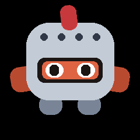 | `fable_fight` — swinging a burning sword at a dragon, firelight pulsing in time with every strike | 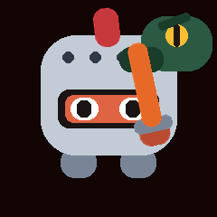 |
| **Opus** | `rocking_calm` — same guitar, stage lit but not pulsing | 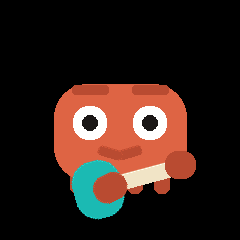 | `rocking` — strums on a purple stage, the grid flashing to the beat | 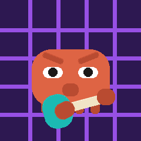 |
| **Sonnet** | `focused` — hard angled brows, narrow eyes, almost no movement | 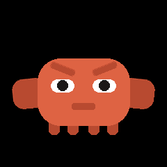 | `working` — hunched behind a laptop, typing, and now and then tilting the mug back for a drink | 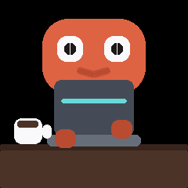 |
| **Haiku** | `chill` — raised brows, wide eyes glancing aside, easy sway | 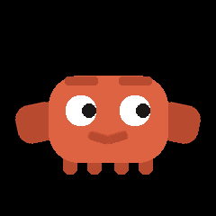 | `happy` — eyes shut in `^^` arcs, wide grin, blushing, bouncy | 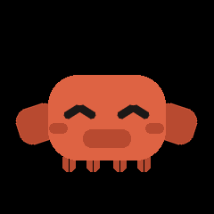 |

Three states override the model:

| | | When | Tell |
|---|---|---|---|
| **idle** | 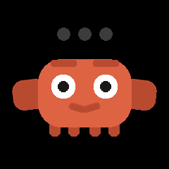 | nothing written for 5 min | three dots lighting in turn overhead — Claude is waiting on you |
| **tired** |  | session ≥ 85% | **stays in whatever set it was already in** and nods off there — see below |
| **asleep** |  | session ≥ 100% | tucked into bed under a blanket, snoozing `z`s |

Resolved in this order: **quota → idle → model → effort**. Idle outranks model
and effort because those describe the last thing that *ran*, not what is
happening now.

### Nodding off in place

Passing 85% does **not** cut to a generic sleepy animation. Each set has its
own tired version, so the crab keeps its props and simply falls asleep where it
is — swapping a crab at a desk for a bare crab on black read as a different
character appearing.

| | | |
|---|---|---|
|  | 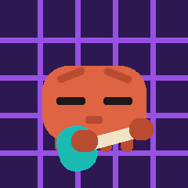 | 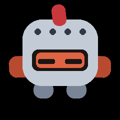 |
| coffee gone cold, claws resting on the keys | guitar unstrummed, stage lights still on | shut behind the visor |

Each is *cheaper* than the mood it replaces, not dearer — the busy motion is
what costs. Moods with no set of their own (`focused`, `chill`, `happy`) fall
back to the shared `sleepy`. 100% keeps the shared bed scene deliberately: the
session is spent and the crab has stopped working, so leaving it slumped at its
desk would say the opposite of what has happened.

Each mood is separated by a *categorical* feature — brow angle, eye shape, a
prop — rather than by size. An earlier version varied only eye height (10 / 7 /
5 px) and mouth width, and on the actual panel focused and sleepy were
indistinguishable while happy read as neutral. A few pixels of difference is not
legible through a round bezel; eyebrows and props are.

The artwork is original and generated by a script
(`firmware/tools/make_crab_lottie.py`), so a tweak is a one-line edit to its
`MOODS` table. Every shape is a rounded rect, which keeps ThorVG's software
rasteriser affordable on a chip with no GPU. Anthropic's "Clawd" is their IP
with no open licence, so nothing here is traced from it.

## Hardware

| | |
|---|---|
| MCU | ESP32 (no PSRAM), 16 MB flash |
| Display | GC9A01 240×240 round SPI TFT |
| Buttons | 2 × momentary to GND — GPIO4 (up), GPIO19 (down) |
| Link | Bluetooth LE (NimBLE), device advertises as `esp32-claude` |
| Power | USB |

Display pins live in `firmware/lib/TFT_eSPI_Setup/User_Setup.h` and survive
changing the `board =` target.

## Setup

### Firmware

```bash
cd firmware
pio run -t upload        # build + flash over USB
pio device monitor       # serial @ 115200
```

### Host

```bash
cd host
pip install -r requirements.txt
python esp32-claude.py
```

Start it automatically at login:

```powershell
powershell -ExecutionPolicy Bypass -File host\install_autostart.ps1
```

(Windows. Uses a Startup-folder shortcut, since registering a Scheduled Task
needs admin. Remove with `-Uninstall`.)

## How it works

```
ccusage ──┐
          ├─→ host/esp32-claude.py ──BLE(GATT write)──→ ESP32 ──→ LVGL ──→ display
~/.claude.json ──┘                                       ↑
  (real quota %)                                    GPIO4 / GPIO19
~/.claude/projects/*.jsonl                            (navigation)
  (model + effort, and mtime = idle clock)
```

The device is the BLE **peripheral**; the laptop is the central and pushes a
72-byte packed struct (`UsageState`) every time something visible changes, plus
a heartbeat. Time is synced on every connect, so the display can age its own
data and detect when a quota window has rolled over.

Three data sources, because no single one has everything:

| Source | Provides |
|---|---|
| `ccusage daily` / `weekly` / `blocks` | token and cost totals |
| `~/.claude.json` (`cachedUsageUtilization`) | the real quota %, and reset times |
| `~/.claude/projects/**/*.jsonl` | current model and reasoning effort; its **mtime** is the idle clock |

Only the `effort` and `message.model` fields are read from transcripts — never
conversation content. Idle detection needs no reading at all: the file's
modification time already is the moment of the last activity.

## Notes for anyone building something similar

Things that cost real debugging time here, in case they save you some:

- **ThorVG needs a 32 KB task stack.** Its Lottie parser recurses deeply and
  runs on whichever task calls `lv_timer_handler()` — Arduino's `loopTask`,
  which defaults to 8 KB. It crash-loops with `LoadProhibited` *regardless of
  free heap*, so shrinking the animation never helps. LVGL's own `#error` guard
  for this is nested inside `#if LV_USE_OS`, so a no-OS build gets no warning.
- **ThorVG refuses to reload a `Picture`** (`if (paint || surface) return
  Result::InsufficientCondition;`) and `lv_lottie_set_src_data` ignores the
  return code. Swapping animations therefore does nothing unless you destroy and
  recreate the widget. Clear the shared buffer too, or the old frame ghosts
  through the transparent gaps.
- **`lv_lottie_set_src_data` assumes 60 fps** when deriving duration
  (`frames * 1000 / 60`). Animations authored at another rate play at the wrong
  speed until you override it from `tvg_animation_get_duration`.
- **`lv_display_set_buffers` asserts on buffer alignment.** A plain
  `static uint8_t buf[]` only guarantees 1-byte alignment; use `alignas`. With
  `LV_USE_LOG` off, the assert is a silent `while(1)` — the board just stops
  with no output at all.
- **`esp32dev` assumes 4 MB flash.** If your board has 16 MB, set
  `board_upload.flash_size` and a matching partition table or you are capped at
  a 1.31 MB app partition.
- **Quota percentages are weighted**, not proportional to tokens — long contexts
  cost more even when cached. Do not try to derive them.

## Credits

**[ccusage](https://github.com/ryoppippi/ccusage)** by [@ryoppippi](https://github.com/ryoppippi)
does the heavy lifting for token and cost accounting. It parses Claude Code's
local JSONL transcripts and turns them into clean daily / weekly / block totals,
which is the entire reason this project did not need to write its own log
parser. If you want usage reporting in a terminal rather than on a desk gadget,
use ccusage directly — it is excellent.

Pinned against `ccusage 20.0.19`; its JSON schema has shifted between releases,
so re-check before bumping.

Also built on [LVGL](https://lvgl.io/), [TFT_eSPI](https://github.com/Bodmer/TFT_eSPI),
[NimBLE-Arduino](https://github.com/h2zero/NimBLE-Arduino),
[ThorVG](https://github.com/thorvg/thorvg) and [bleak](https://github.com/hbldh/bleak).

## Licence and disclaimer

Unofficial and unaffiliated with Anthropic. "Claude" and "Claude Code" are
Anthropic's marks; the crab here is original artwork, not Anthropic's Clawd.
`*_cents` values are what the tokens would cost at API rates — not money spent
on a subscription.
